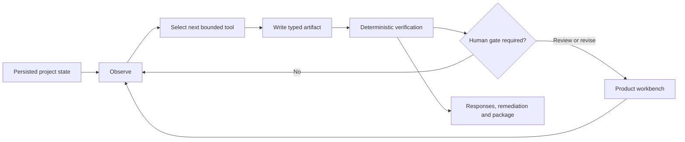

<div align="center">

# Dart · BidEvidence

BidEvidence is a traceable bid workspace that keeps tender requirements, company evidence, response writing, and human review connected.

[Product tour](docs/FINAL_PRODUCT_AUDIT.md) · [Case study](docs/CASE_STUDY.md) · [Architecture](docs/ARCHITECTURE.md) · [Run locally](docs/PORTFOLIO_RUNNING_GUIDE.md) · [Acceptance](docs/FINAL_ACCEPTANCE.md)

</div>


BidEvidence is an independent product and engineering project. I defined the problem, studied the workflow, designed the product and interface, implemented the frontend and backend, built the demo data, and owned testing and delivery.

## What it does

Tender work rarely lives in one document. Requirements, amendments, company certificates, past projects, price sheets and response drafts all need to stay connected.

BidEvidence（标证通）keeps each important decision close to its source: the document, page, excerpt, evidence, rule result and human review state. It gives bid managers one place to move from file intake to final review without turning the process into a chat interface.

The demo uses synthetic Chinese tender files and `MockLLMProvider`. It contains no customer data and makes no claim about live-model accuracy.

The interface opens in English by default and can be switched to Chinese from the user menu. Project names, tender clauses, filenames, source excerpts and other Chinese business records stay in their original language.

## Product flow

```text
File intake → Compliance review → Evidence library → Response writing
            → Remediation → Package review → Final review
```

1. **File intake** — collect the main tender, appendices, amendments and clarifications; retry failed files individually.
2. **Compliance review** — review requirements beside their original page and excerpt.
3. **Evidence library** — turn certificates and project records into claims with owner, validity and source.
4. **Response writing** — write against each requirement using evidence that has already been accepted.
5. **Remediation** — assign missing or conflicting items and send them back for review.
6. **Package review** — check required files, naming, revisions and the package manifest before approval.
7. **Final review** — inspect risks, sources, evidence, responses, tasks and package state in one pass.

[See the seven production screens](docs/FINAL_PRODUCT_AUDIT.md)

| Works today | Still being developed | Kept out of automation |
| --- | --- | --- |
| Seven-step workflow, 24 sourced requirements, 17 evidence claims, 24 responses, deterministic checks, remediation and delivery gates | Response diffing, comments, DOCX style preview and signed desktop distribution | Legal qualification decisions, CA signing, guarantee payments, CAPTCHA handling and external submission |

## Why it is designed this way

Every important conclusion links back to a document version, page, clause and excerpt. A response can cite evidence only after a reviewer has accepted it.

Language models help with classification, candidate extraction, ranking and explanation. Money, dates, counts, entity identity, validity periods, required files and hashes are checked by versioned code.

Generating a draft is not the same as approving a submission. The fixed demo deliberately includes an expired certificate, an incomplete project-reference chain and a missing authorization file. The package can be previewed, but it cannot silently pass the final gate.

The workflow can advance through bounded runs, but submission and other consequential decisions stay under human control. This is a working portfolio project, not a legal-advice service or signing tool, and it never performs guarantee payment, CAPTCHA handling or external submission.

## Architecture

The product remains artifact-first rather than chat-first. Its background workflow can read persisted project state, choose one action from a closed tool registry, write a sourced artifact, verify it, and pause for review before continuing.



- **Web:** Next.js App Router and TypeScript.
- **API:** FastAPI, Pydantic v2, SQLAlchemy 2 and Alembic.
- **Rules:** amount, date, quantity, entity, validity, consistency, file and hash checks.
- **Workflow runtime:** durable runs, bounded iterations, a closed tool registry, typed artifacts, resumable failures and explicit approvals.
- **Model boundary:** a structured provider interface; local runs and tests default to `MockLLMProvider`.
- **Traceability:** document versions, page excerpts, claims, rule codes, review reasons and append-only records.

[Architecture notes](docs/ARCHITECTURE.md) · [Workflow loop, rules and human review](docs/AI_DESIGN.md)

## Run locally

Requirements: Docker Compose v2 and Python 3.

```bash
make demo
```

Then open:

- Web: `http://localhost:3000/projects`
- API: `http://localhost:8000/docs`
- Demo account: `admin@demo.local` / `demo1234` (development only)
- Fixed project: `00000000-0000-0000-0000-000000000003`

Stop the services with:

```bash
make down
```

For a clean review, start with a fresh data volume. Re-seeding an older fixture database can hit stable document-ID conflicts; this does not affect the clean demo path.

[Full running guide](docs/PORTFOLIO_RUNNING_GUIDE.md)

## Verification

The fixed demo oracle contains:

- 24 requirements with document, page and clause sources;
- 7 evidence files and 17 structured claims;
- 14 deterministic checks with `rule_code`;
- 7 remediation tasks, 9 package entries and 24 responses;
- 1 deliberately missing required authorization file, leaving the package unapproved.

Current frontend acceptance:

- ESLint, TypeScript and the production build pass;
- 20 test files, 109/109 tests pass, including locale persistence and source-language protection;
- Playwright E2E: 7 passed, 1 skipped;
- Batches 01–05 received Pro `PRODUCT_ACCEPT` and Codex `TECH_ACCEPT`;
- the final portfolio package received `PORTFOLIO_ACCEPT` and the GitHub presentation received `README_ACCEPT`.

```bash
make verify-demo
make acceptance
make test
make lint
make verify
```

[Test evidence](docs/PORTFOLIO_TEST_EVIDENCE.md) · [Final acceptance](docs/FINAL_ACCEPTANCE.md) · [Evaluation boundaries](docs/EVALS.md)

## Project notes

I led the work from problem framing to acceptance:

- product scope, competitor research and the seven-step workflow;
- information architecture, interaction design and visual convergence;
- the Next.js frontend, FastAPI backend, domain model and deterministic rules;
- the bounded workflow loop, closed tool contracts, artifact model and human approval gates;
- synthetic PDF/DOCX/XLSX fixtures, the fixed oracle and automated tests;
- product review, technical acceptance, evidence capture and packaging.

AI tools helped with research, implementation and review. Product choices, capability boundaries, engineering judgment and final acceptance remained my responsibility.

[Case study](docs/CASE_STUDY.md) · [Authorship](docs/AUTHORSHIP.md) · [Competitor UI review](docs/COMPETITOR_UI_AUDIT_2026-07-19.md) · [Capability map](docs/EXISTING_CAPABILITY_MAP.md) · [Apache-2.0](LICENSE)
