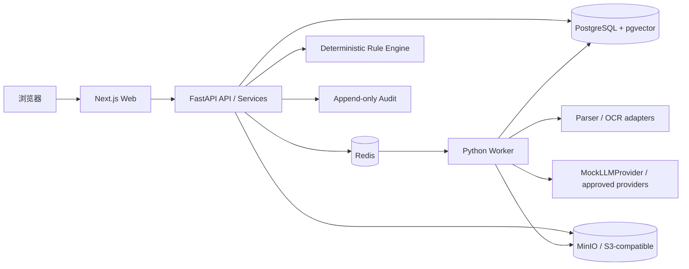
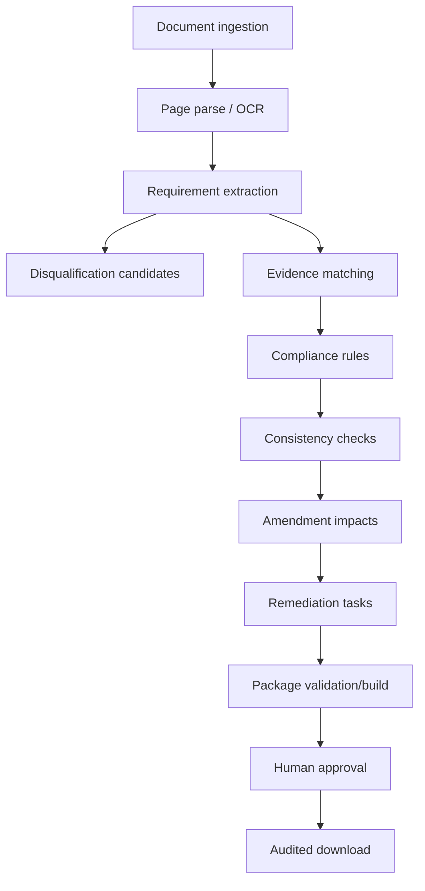

# 系统架构

## 1. 总体结构

Web 只负责展示和交互，不嵌入业务裁决。API Route 只做认证、Schema 边界和 service 调用。Domain/service/rules 承担状态转换和计算。Worker 是耗时任务边界；PostgreSQL 是结构化事实源，文件通过 StorageAdapter 保存，Redis 状态可重建。

## 2. 领域工作流

每一步的输入/输出均落库并带 tenant、版本和来源。模型结果是候选，规则和人工决定是独立记录，不通过覆写模型结果“修正历史”。

## 3. 服务职责

- DocumentIngestionService：文件名/MIME/魔数/大小/SHA256、版本、隔离存储和解析任务。
- RequirementExtractionService：页面分类、分批抽取、Schema/页码验证、去重和低置信度路由。
- EvidenceService：材料生命周期、Claim、主体/有效期、使用项目和人工验证。
- EvidenceMatchingService：规则过滤、语义排序和理由；禁止自动接受。
- ComplianceService：版本化确定性规则，输出 expected/actual/result/reason/sources。
- ConsistencyService：项目事实标准化、聚类、冲突和多来源比较。
- AmendmentService：原条款对齐、增删改、影响图、Requirement 版本和重新审批。
- RemediationService：从具体来源创建任务并记录状态转换。
- PackagingService：文件树、校验、预览、ZIP、SHA256 manifest 和审批守门。
- AuditService：所有关键写入、运行、审批和下载的追加式事件。

## 4. API 和异步契约

API 基础路径 `/api`，健康检查 `/health`。异步启动返回 `job_id/status/progress/current_step/retryable/error`；客户端轮询或使用 SSE/WebSocket。错误响应使用稳定 code、message、request_id，不暴露堆栈或密钥。

金额使用 Decimal 字符串，日期为 ISO 8601，标识为 UUID。来源统一保存 document_id/version/page/bbox/excerpt；fixtures 使用稳定 `key` 和 `filename:page`，seed 时解析为数据库外键。

## 5. AI、Parser 和 Storage Adapter

- ParserAdapter 将 Docling、PaddleOCR 或 MinerU 映射到内部 DocumentPage/Layout，不泄漏供应商结构。
- LLMProvider 默认 Mock；真实 OpenAI/兼容 Provider 必须经凭证授权、脱敏和单独配置。
- StorageAdapter 支持本地受控目录与 S3-compatible；下载使用短期签名 URL。
- ComplianceRule 是版本化纯函数/服务；模型不得参与金额、日期、数量或最终状态计算。

## 6. 幂等、版本和一致性

上传幂等键为 tenant/project/SHA256；解析键加入 document/parser/prompt 版本；Requirement 由文档、条款、规范化文本哈希和 extraction version 去重。公告应用产生新 Requirement 版本，不删除旧条款。包版本不可原地替换，manifest 对每个归档路径计算 SHA256。

## 7. 多租户与审计事务

tenant_id 来自认证上下文，客户端字段不能授权。Repository 查询与外键解析必须 tenant scoped。高风险状态转换与 AuditEvent 在同一事务；审计写入失败时操作失败关闭。ModelRun 记录 provider/model/prompt/input/output hash、耗时、token、成本和错误。

## 8. 本地与生产拓扑

Compose 提供 PostgreSQL/pgvector、Redis、MinIO、API、Worker 和 Web。本地可用 SQLite 和本地 StorageAdapter 跑测试。生产要求固定镜像摘要、TLS、secret manager、非 root、托管数据库/对象存储、备份恢复、对象生命周期和迁移门禁。外部提交、CA 和付款不属于该拓扑。
