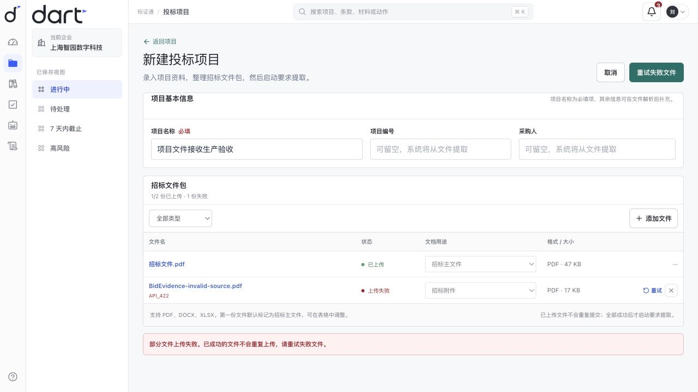
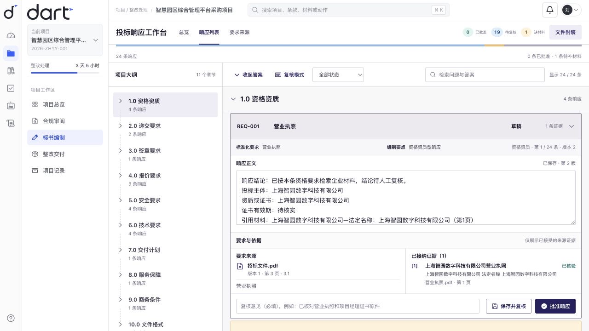
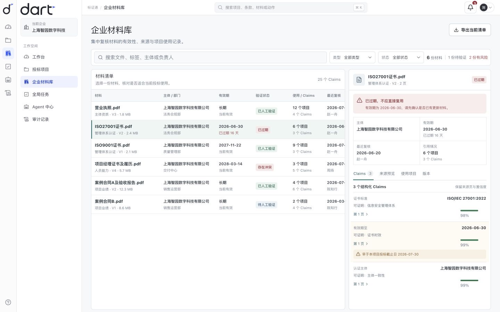
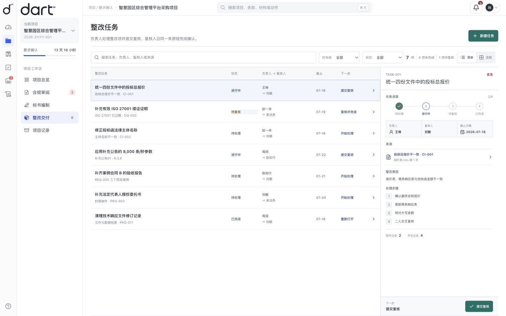
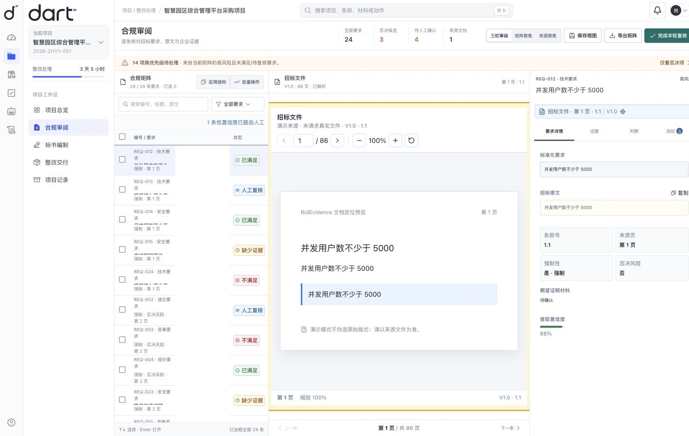
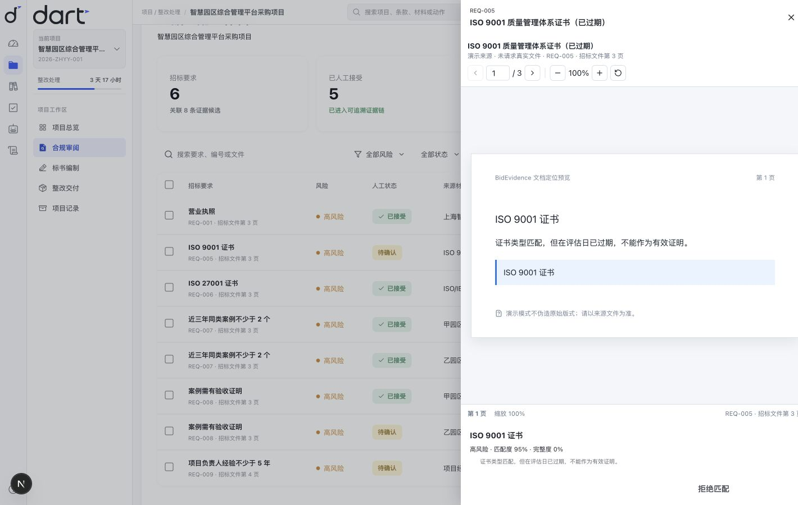
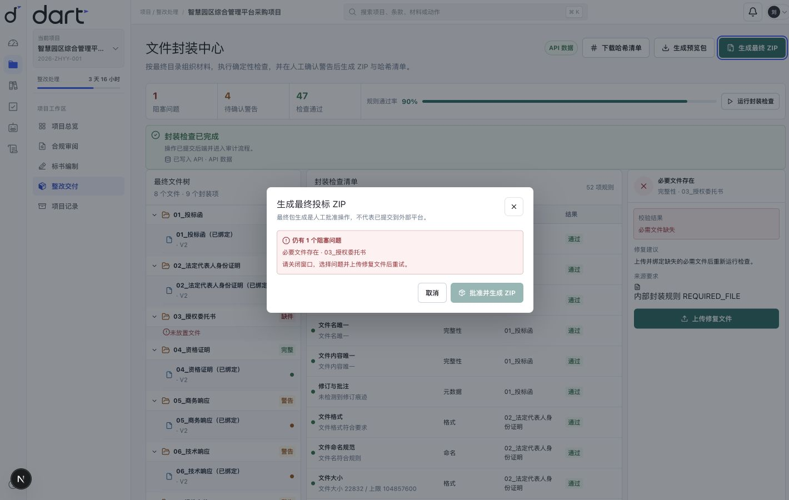

# 案例复盘：Dart · 标证通 BidEvidence

`Dart` 是当前仓库与界面字标；`标证通 BidEvidence` 是本案例中的产品名称。

## 一句话概括

BidEvidence 是一个面向投标经理与复核人员的招投标合规和交付工作台。它把“模型能读懂什么”与“组织可以承诺什么”拆成两层：模型生成带来源的语义候选，代码规则校验事实，授权人员接受证据、复核响应并批准交付。

> 案例状态：可本地运行的仓库作品；业务数据为合成 fixtures。本文不声称真实用户量、效率提升、商业结果或真实模型指标。

## 问题：投标不是一次问答

长篇招标文件的问题不只在“内容多”，还在于信息分散且约束相互影响：

- 要求藏在主文件、附件、答疑和补充公告的不同页；
- 企业证照、案例、人员材料有主体、版本和有效期；
- 同一金额、名称或技术参数可能在 DOCX、XLSX、PDF 中冲突；
- 一段自然语言响应即使写得流畅，也可能引用过期证书或遗漏必需文件；
- 最终 ZIP 能生成，不代表已经满足命名、完整性、签章或人工批准门禁。

通用聊天界面适合探索，但不适合作为正式承诺的唯一工作面。投标人员需要的是逐条要求、来源定位、证据状态、响应正文和交付阻断项同时可见，并且每一次人工决定都有原因。

## 竞品研究：复刻任务结构，不复制品牌外观

2026-07-19 的[竞品 UI 审阅](COMPETITOR_UI_AUDIT_2026-07-19.md)覆盖 GovDash、Loopio、Responsive 和 MyPitchFlow 的公开流程或受控登录态体验。研究得到的不是“再做一个 AI 写作器”，而是三类可复用能力：

| 参考方向 | 观察到的任务结构 | BidEvidence 的本地化取舍 |
| --- | --- | --- |
| GovDash / Responsive | 要求拆解、合规矩阵、citation 与 Source View | 采用要求—详情—原文三栏和页码定位，不复制美国政府采购阶段或品牌文案 |
| Loopio | 受控知识库、内容新鲜度、来源提示 | 材料先拆成有主体、有效期和来源的 Claim；只有人工接受的证据进入响应依据 |
| MyPitchFlow | 长文档编辑、状态、版本、AI review 与知识库 | 采用逐项复核和键盘工作流；不复刻黑箱等待、无反馈下载或尚无真实契约的版本按钮 |

当前产品中心仍是“项目与文件 → 合规矩阵 → 原文与证据 → 响应复核 → 整改 → 交付检查 → 最终人工复核”，Agent 运行、审计和本地环境只提供辅助说明。优先级与复用边界分别见 [`CURRENT_PRODUCT_PRIORITY.md`](CURRENT_PRODUCT_PRIORITY.md) 和 [`EXISTING_CAPABILITY_MAP.md`](EXISTING_CAPABILITY_MAP.md)。

响应编制页最终只采用 Loopio List View 作为界面母版：项目大纲、状态行和单条原位展开来自同一套列表语法，没有混入文档纸张、AI 助手侧栏或另一套卡片设计。合规审阅则沿用 GovDash / Responsive 的矩阵、来源页和详情联动，三栏审阅、矩阵聚焦与来源聚焦均为真实视图，而非只改变按钮状态。

## 核心工作流

```text
项目与文件接收
→ 要求候选抽取与页码/原文校验
→ 企业材料生成 Claim
→ 主体/类型/有效期硬过滤 + 语义排序
→ 人工接受或拒绝
→ 响应编制、修改原因与人工批准
→ 一致性和补充公告影响
→ 整改任务
→ 文件树、确定性校验、预览 ZIP
→ 终审清单与真实工作台回跳
→ 最终人工结论
```










## 关键决策一：不用聊天框承载正式复核

### 决策

把响应编制界面收敛为一套稳定的列表工作台：左侧只承担项目章节导航，右侧连续呈现响应条目；当前条目在原位置展开正文、要求来源和已接受证据。

### 为什么

聊天回答会压平来源、状态和对象关系。投标复核需要回答“当前在审哪一条、原文在哪一页、引用了哪项 Claim、谁做了最后决定”，而不是只保留一段模型总结。

### 可见证据

- 要求工作台支持列表、详情、页码原文和人工确认；
- 项目文件接收逐份显示真实上传状态；部分失败时保留已创建项目和成功文件，单文件可重试或移除，全部成功前不启动要求提取；
- 企业材料库围绕“这份材料是否适合作为候选证据”组织列表、有效期、复核时间、Claims、使用项目和当前版本；不再用六项 KPI 或假解析队列分散任务；
- 整改任务围绕“负责人下一步做什么、何时交给复核人”组织工作清单和详情；顺序状态流转调用原有 API，移动端不再依赖横向看板；
- 合规工作台可在三栏、矩阵和来源三种任务视图间切换，并恢复已保存的搜索、筛选与视图；
- 批量选择只对当前可见要求生效，出现真实的分配与清除选择动作；
- 响应工作台聚合 requirement/source/evidence projection，而不是另造平行数据；
- 章节与当前答案可真实收起，恢复高密度列表扫描；筛选不会重排章节编号；
- 复核意见、保存和批准保持在展开项首屏，正文未保存时批准入口禁用；
- `J/K`、方向键和 `Esc` 支持逐项复核，编辑框聚焦时不会截获按键；
- API 失败不会静默替换成演示记录，空列表也不会被伪造成“有数据”。

实现锚点：[`requirements-workbench.tsx`](../frontend/features/requirements/requirements-workbench.tsx)、[`response-workbench.tsx`](../frontend/features/responses/response-workbench.tsx)、[`responses.ts`](../frontend/lib/api/responses.ts)。



## 关键决策二：语义理解与事实判断分层

### 决策

LLM 只用于页面分类、要求/Claim 候选抽取、否决项候选分类、语义匹配排序和解释建议。金额、日期、数量、有效期、一致性和最终合规结果由版本化代码规则处理。

### 为什么

“语义相似”只能回答材料可能相关，不能回答材料是否仍然有效、属于正确主体或满足数值门槛。置信度也不是准确率。

### 可见证据

固定 oracle 中，`REQ-005` 与 ISO 9001 Claim 的语义候选分数是 `0.95`，但证书在 2025-12-31 到期；`CERT_VALID_ON_DATE_V1` 以 2026-07-30 为评估日给出 `fail`。相反，ISO 27001 有效至 2027-12-31，主体、类型和有效期均匹配。

这里的 `0.95` 是**合成 oracle 中的预期候选值**，不是 DeepSeek 或其他真实模型的实测准确率。它的用途是验证系统能否拒绝“高分但无效”的证据。

设计边界见 [`AI_DESIGN.md`](AI_DESIGN.md)，固定样本见 [`expected_results.json`](../demo/expected_results/expected_results.json)。



## 关键决策三：把人工决定放进响应与交付门禁

### 决策

证据匹配、响应批准和最终封装都保留人工门禁：

- 模型只能创建 suggested/needs_review，不能创建 accepted；
- 人工编辑响应必须填写修改原因，保存后重新进入复核；
- 缺少材料的响应不能批准；
- 必需封装项失败时，预览 ZIP 与最终批准分离；
- 最终复核先暴露所有前置未完成项，只允许回到真实业务工作台处理；
- 系统不执行 CA 签名、保证金付款或外部平台提交。

### 为什么

投标文本是组织承诺。生成能力如果直接连接到接受、批准或提交，会把模型建议误当成授权行为。

### 可见证据

固定封装数据包含 9 个文件项，其中授权委托书为必需项且故意缺失；包状态保留 `approved=false` 与 `must_not_mark_ready=true`。报价文件名、Word 修订记录、案例 B 缺验收和最终格式问题继续作为警告展示，而不是被生成过程自动抹平。

实现锚点：[`responses.py`](../backend/app/services/responses.py)、[`package-center.tsx`](../frontend/features/package/package-center.tsx)、[`final-review.tsx`](../frontend/features/review/final-review.tsx) 与 [`expected_results.json`](../demo/expected_results/expected_results.json)。



## 三个失败案例

这些是演示数据中刻意保留的反例，不是线上生产事故。

### 1. 匹配分数高，但证书已经过期

- 表面结果：ISO 9001 类型与要求语义高度匹配。
- 真实问题：证书早于评估日失效。
- 系统处理：保留候选与来源；有效期规则判定失败；转人工补充有效证书，不允许自动接受。
- 产品启示：排序分数不能代替业务有效性。

### 2. 案例合同存在，但证明链不完整

- 表面结果：案例 B 合同可以证明项目经历。
- 真实问题：要求需要两份验收证明，当前只有案例 A 的验收报告。
- 系统处理：合同 Claim 可用于案例数量，相关文档规则仍对验收材料给出 fail，并创建有来源的整改任务。
- 产品启示：同一文件不能被扩大解释为它没有证明的事实。

### 3. 预览包能生成，但最终交付仍被阻止

- 表面结果：系统可以构建文件树、ZIP 和 SHA256 清单。
- 真实问题：必需授权委托书缺失，同时存在命名和修订记录警告。
- 系统处理：预览与批准分离；不得标记 ready/approved；外部签章与提交始终留在系统外。
- 产品启示：技术上的“产物生成成功”不是业务上的“可以投标”。

## 验证方式

仓库用固定 oracle、代码测试和独立验收拆开验证，避免“实现和测试同时误读同一份数据”：

| 层级 | 验证内容 | 命令 |
| --- | --- | --- |
| Fixture | 合成 PDF/DOCX/XLSX、数量和来源引用可重复生成 | `make generate-demo` |
| Oracle | 24 条要求、14 项合规检查、故障样本与哈希结构 | `make verify-demo` |
| 独立验收 | Claim 引用、人工接受门禁、规则版本、公告影响、ZIP/manifest/path safety | `make acceptance` |
| 应用测试 | 后端服务/API、前端状态与交互 | `make test` |
| 完整门禁 | lint/typecheck、Compose、Playwright、Next production build | `make verify` |

AI 评测定义区分要求/强制/否决召回、来源准确率、Evidence Top-3、无依据结论和人工覆盖率，详见 [`EVALS.md`](EVALS.md)。其中发布门禁目标不是本案例自动声称的实测成绩；任何真实 Provider 结果都应附 git SHA、模型、prompt 版本、数据集、失败样本、token、成本和延迟后再发布。

## 边界

- 上传内容永远是不可信数据，不能改变系统指令或获得网络、数据库写入、文件删除、付款、CA 或提交权限。
- AI 不作法律资格判断，不自动接受证据，不覆盖人工决定。
- 金额、日期、数量、有效期、文件清单和哈希不交给 LLM 计算。
- `<0.70` 的候选强制进入人工复核；更高置信度仍然可以被人拒绝。
- 正式响应只引用已接受证据；暂定匹配不会被包装为正式来源。
- API、演示数据和失败状态明确区分。

## 当前局限

1. 数据集是单个合成中文招标项目，不代表真实行业分布。
2. 本地、测试和 CI 默认使用 MockLLMProvider；目前没有可公开引用的 DeepSeek 或其他真实模型 precision、recall、F1、成本和延迟报告。
3. 扫描件与复杂表格效果受 OCR/解析环境影响，容器和桌面发行仍需配置对应二进制与中文语言数据。
4. 响应版本历史与比较、章节负责人/复核人、评论/@协作、DOCX 样式预览和独立导出尚未完整具备。
5. 本地桌面宿主尚无签名或公开分发安装包；生产身份、TLS、备份、病毒扫描和消息通知仍需部署适配。
6. 签章、保证金、验证码和外部提交不在自动化范围内。

## 个人贡献与 AI 协作

这是我的个人主导作品。我从问题定义与竞品研究开始，完成了产品规划、核心工作流设计、界面与交互收敛、前后端实现、合成数据、测试验收和作品封装。

我的主要工作包括：

- 把“AI 写投标书”重新定义为证据约束下的正式承诺工作流；
- 规划文件接收、合规审阅、企业材料、标书编制、整改、交付和终审七个阶段；
- 选择竞品任务结构并完成本地化取舍，避免多套界面语言混杂；
- 实现 Next.js 前端、FastAPI 后端、领域模型和确定性规则；
- 建立合成文档、固定 oracle、单元/集成/E2E 和独立交付验收；
- 组织 Pro 产品复审、Codex 技术验收、截图证据和最终投递包。

AI 工具用于加速资料整理、方案讨论、代码实现和交叉复审；产品方向、能力边界、竞品取舍、工程判断和最终验收由我负责。更完整的边界见 [`AUTHORSHIP.md`](AUTHORSHIP.md)。

本文不使用“全部代码逐行手写”“真实客户项目”“已产生商业指标”或没有原始报告支撑的真实模型成绩等表述。

## 复用决定

这次作品封装没有新增产品路由、页面、API、Schema 或平行工作台。叙事复用的现有锚点是：

- 要求审阅：`frontend/features/requirements/requirements-workbench.tsx`
- 响应编制：`frontend/features/responses/response-workbench.tsx`
- 证据匹配：`frontend/features/evidence/evidence-matching-workbench.tsx`
- 文件封装：`frontend/features/package/package-center.tsx`
- 最终复核：`frontend/features/review/final-review.tsx`
- 响应服务：`backend/app/services/responses.py`
- AI 边界：`docs/AI_DESIGN.md`
- 评测门禁：`docs/EVALS.md`
- 固定 oracle：`demo/expected_results/expected_results.json`

新增本文件的唯一目的，是把已有产品、验证证据和局限组织成可审阅的案例复盘，不改变产品行为。
