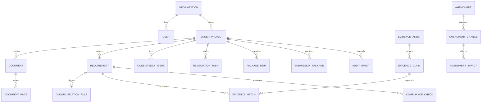

# 数据模型

## 1. 公共约束

核心实体使用 UUID，含 `tenant_id/created_at/updated_at/created_by/version`；金额为 Decimal + currency，时间存 UTC。业务删除使用软删除，AuditEvent/ModelRun/包版本追加写入。所有查询和外键解析都必须 tenant scoped。

## 2. 聚合关系

## 3. 项目、文档和要求

- Organization/User：法定名称、信用代码、时区、角色和状态。
- TenderProject：项目/采购人/编号/预算/deadline/status/stage/risk/progress/owner。
- Document：类型、原文件名、对象键、MIME、size、SHA256、版本/父版本、当前版本、解析状态和页数。
- DocumentPage：一基页码、raw_text、markdown、layout_json、页图、ocr_used；layout 支持 bbox、表格、标题和页眉页脚。
- Requirement：编号、分类、标准化要求、原文、mandatory/否决风险、operator/expected/unit/timeframe、来源文件/页/bbox/条款、置信度、review_status 和 human_verified。
- DisqualificationRule：触发方式、说明、严重度、关键词、确定性规则、候选/确认/驳回和人工理由。

Requirement 状态为 unreviewed、satisfied、partially_satisfied、not_satisfied、missing_evidence、conflict、manual_review、not_applicable。置信度 `<0.70` 必须为 manual_review。

## 4. 企业证据

EvidenceAsset 保存类型、主体、文档、有效期、状态、owner、敏感级别、标签和复核信息。一份材料包含多个 EvidenceClaim；Claim 保存 subject/predicate/value/unit、有效区间和页码原文。

EvidenceMatch 连接 Requirement 与 Claim，保存 score/type/status/reason、是否 AI 创建和 human_decision/reason。AI 创建的记录只能 suggested/needs_review；accepted/rejected 必须有人工 actor 和审计事件。

## 5. 合规与一致性

ComplianceCheck 保存 check_type、expected、actual、result、severity、rule_code/version、reason、source_references、model_run（如有）和复核信息。规则结果只允许 pass/fail/warning/manual_review/not_applicable。

ConsistencyIssue 保存 issue_type/entity_key/field_name、values_found、document_references、severity/status/resolution/assignee。values_found 中每个值必须保留原值、规范化值和来源，解决不能删除其他来源。

## 6. 公告、任务和封装

- Amendment：公告文档、effective_date、summary 和 analysis_status。
- AmendmentChange：added/removed/modified/deadline/budget/scoring/qualification/technical/submission，保留 old/new 和来源。
- AmendmentImpact：连接受影响 Requirement/Evidence/Task/PackageItem，含 description、requires_reapproval 和状态。
- RemediationTask：source_type/source_id、标题、优先级、状态、assignee、due、reviewer 和解决证明。
- PackageItem：parent 树、required、file/naming rule、sort、document、status 和 validation_results。
- SubmissionPackage：项目版本、ZIP/manifest 对象键、SHA256、状态、生成/审批人和时间。

Task 状态为 todo、in_progress、waiting、ready_for_review、done、waived。包存在高风险 fail 时可以生成预览，但不能 ready/approved；审批后新变更必须创建新包版本。

## 7. 审计与模型运行

AuditEvent 保存 actor/action/entity/timestamp、input/output hash、before/after、model/prompt/tool/request/IP/metadata，普通用户无 update/delete。ModelRun 保存 task/provider/model/prompt version、输入输出哈希、耗时、token、成本、状态和错误。人工纠正追加新事件，不覆盖模型输出。

## 8. 唯一性和迁移

建议唯一约束：Document `(tenant_id,project_id,sha256,version_number)`；Requirement `(project_id,document_id,clause_number,normalized_hash,extraction_version)`；EvidenceMatch `(requirement_id,evidence_claim_id,version)`；Package `(project_id,version)`。

模型位于 `backend/app/models`，只通过新 Alembic migration 演进；已应用迁移不可编辑。发布前从空 PostgreSQL `upgrade head`，验证 seed 幂等和历史数据兼容。
