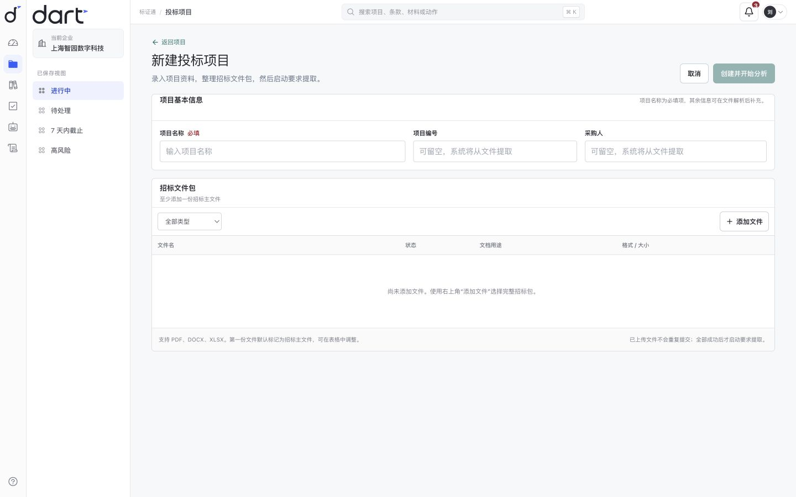
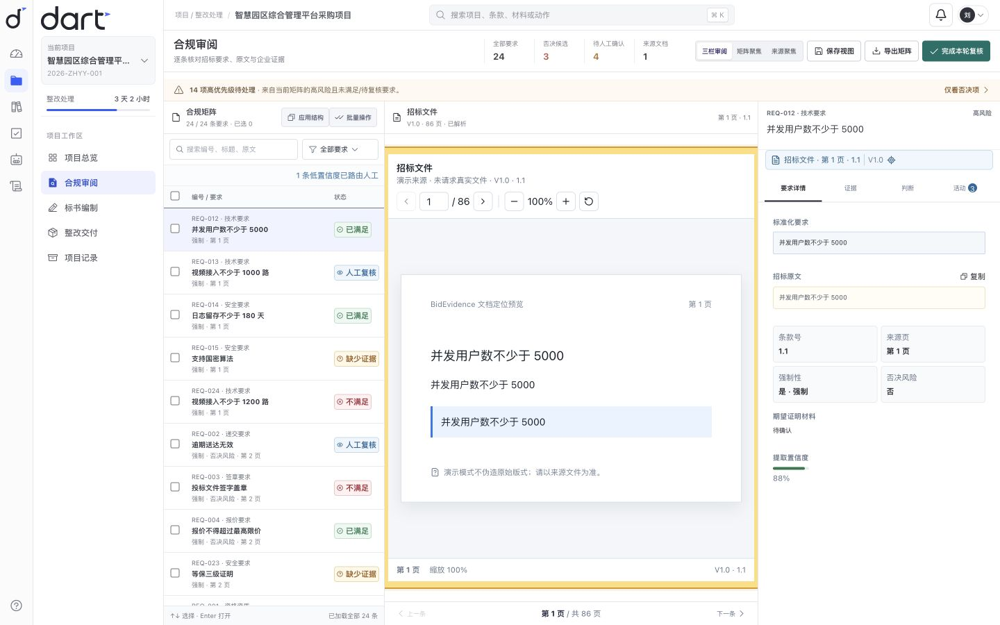
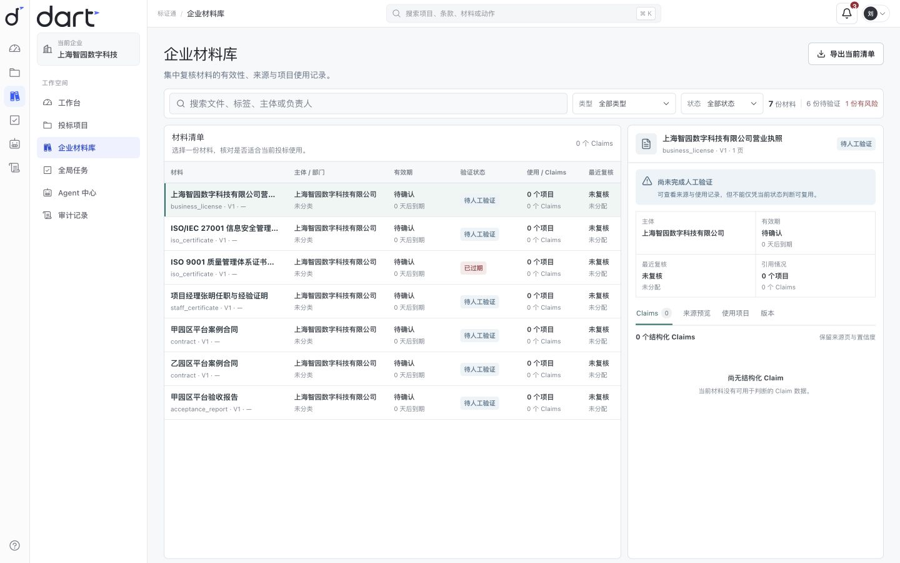
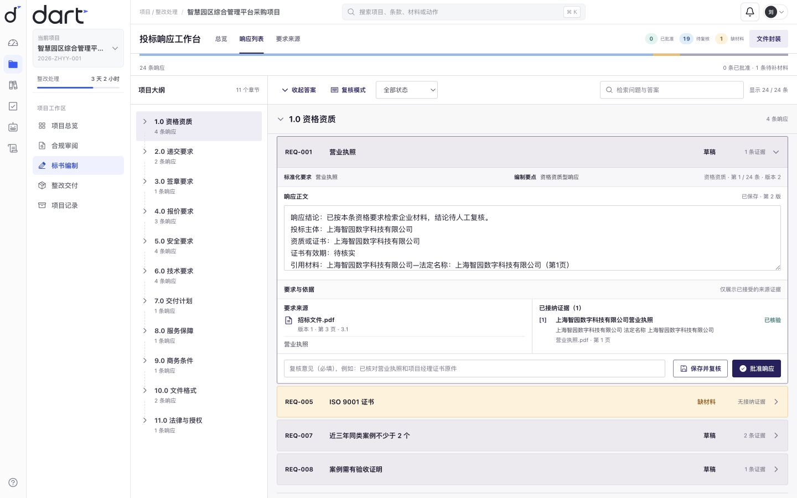
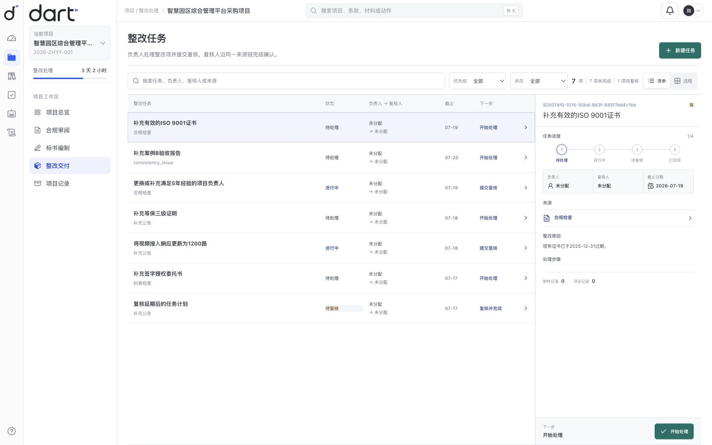
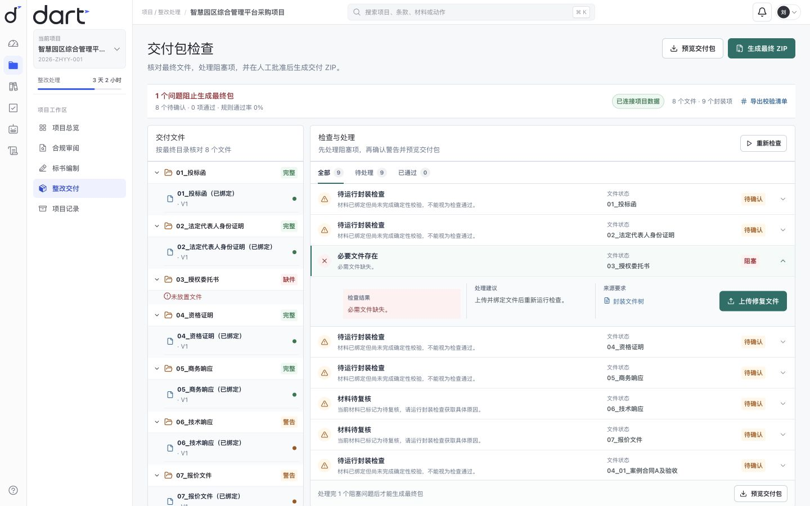
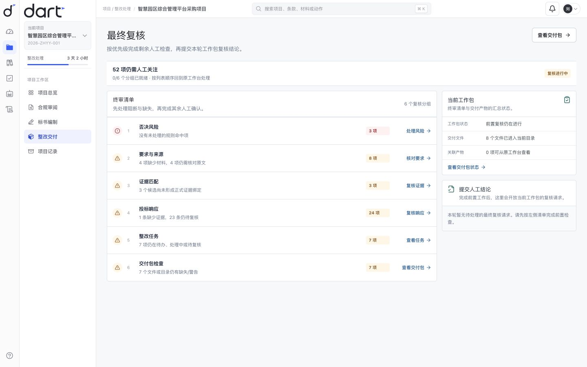
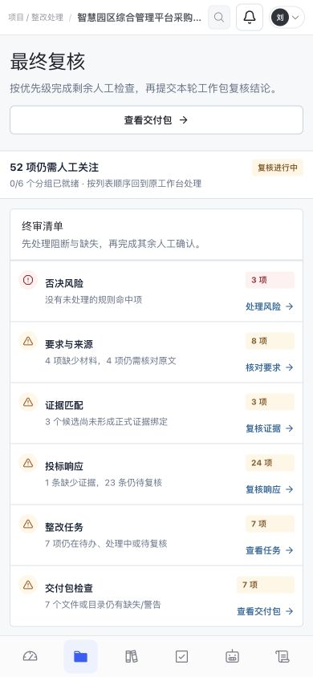

# BidEvidence 全产品终验

日期：2026-07-27
范围：文件接收 → 合规审阅 → 企业材料 → 标书编制 → 整改任务 → 交付包检查 → 最终复核
证据环境：Next.js production build、本地 FastAPI、全新临时 SQLite 种子库、MockLLMProvider
项目：`00000000-0000-0000-0000-000000000003`

## 结论

- ChatGPT Pro：`PRODUCT_ACCEPT`，无 P0/P1。
- Codex：七条真实路由、production build、干净种子库和当前截图成立；未发现阻止封装的技术问题。
- Seed 重入冲突：旧持久库重复执行 seed 会发生稳定文档 ID 冲突；干净库可完整生成终验数据。按本轮作品封装范围记录为 P2，不扩张为发布加固。

## 七步可见验收

1. 文件接收 — 健康
   项目信息、文件包、类型筛选、添加文件、逐文件表格和启动门禁处于同一任务页；空状态明确。

2. 合规审阅 — 健康
   要求列表、文档原文和判断详情形成稳定三栏；来源页码、条款、强制性、否决风险和置信度可见。

3. 企业材料 — 健康
   材料清单与详情并列；有效期、复核状态、Claims、来源预览、使用项目和版本围绕“是否可复用”组织。

4. 标书编制 — 健康
   项目大纲、连续响应条目、正文、要求来源、已接纳证据、复核意见和批准动作保持在列表工作流内。

5. 整改任务 — 健康
   工作清单、状态、负责人到复核人的交接、截止日期、来源和下一步动作清楚；没有用看板装饰代替真实状态链。

6. 交付包检查 — 健康
   文件目录是辅助区，检查与处理是主区；阻塞、待确认、文件绑定、上传修复、预览和最终 ZIP 门禁均使用现有能力。

7. 最终复核 — 健康
   终审清单按否决风险、来源、证据、响应、任务和交付包排序；问题只回跳真实工作台，Agent 仅提供工作包状态。

移动端 — 健康
390px 下保留终审优先级、计数和回跳；桌面辅助区转为后续纵向内容，底部导航不遮挡清单。

## 设计与产品判断

### 成立的部分

- 七页共用同一应用壳层、项目语境、表格/列表密度、状态语义和人工动作语言。
- 页面各自围绕一个工作对象，没有重新混入 Hero、六指标 Dashboard、AI 卡片、聊天侧栏或装饰性流程图。
- Agent 没有成为主页面标题或自动批准入口；最终承诺仍需人工原因与真实 API 动作。
- 每个阶段有明确的输入、异常或风险状态、人工处理动作和下一步。

### P2 记录

- 对外文档应持续使用“参考竞品任务结构，不复制品牌能力”的表达，避免被误读为竞品拼贴。
- 最终投递阅读顺序应固定为：README → CASE_STUDY → 七步截图 → ARCHITECTURE → 运行与测试证据。
- 已有持久库重复 seed 的稳定文档 ID 冲突不影响干净演示和本轮截图，但后续若把一键重复演示作为发布承诺，应单独修复并测试。

## 无障碍证据边界

当前截图可以判断布局、层级、信息密度、移动重排和粗略对比度，不能单独证明键盘焦点、读屏名称、动态通知或 WCAG 等级。已有组件测试与 E2E 覆盖核心交互，但正式无障碍声明仍需专项键盘、读屏和自动化扫描。

## 复用决定

本轮没有新增产品路由、API、Schema、状态模型、服务或第二工作台。新增内容仅为终验文档、当前 production 截图和求职投递包；产品实现继续复用 Batch 01–05 的既有锚点。
